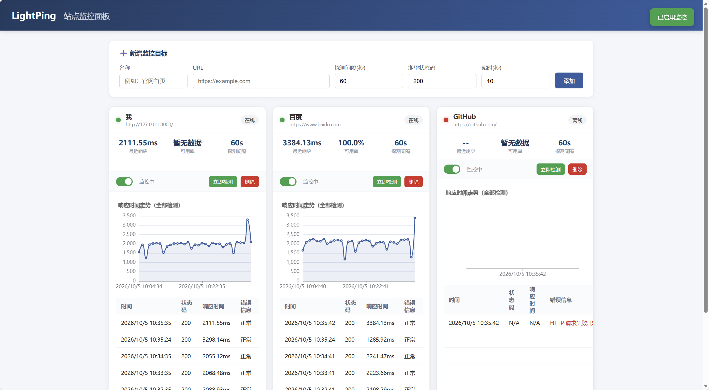

# LightPing

轻量级本地站点可用性监控面板。基于 FastAPI 构建，用于**定时探测你自己的网站 / API 是否在线，记录响应延迟，并在本地 Web 仪表盘上直观展示**。

> 一个全栈开发的小项目：Python 后端 + 原生前端 + SQLite，零额外中间件依赖，两天即可跑通。

[](https://www.python.org/) [](https://fastapi.tiangolo.com/) [](https://www.sqlite.org/index.html) [](https://opensource.org/licenses/MIT) []()


---

##  功能特性

- **监控目标管理**：添加 / 编辑 / 删除监控站点，自定义探测间隔、超时时间、期望 HTTP 状态码
- **自动探测**：基于 APScheduler 后台定时发起 HTTP 请求，异步执行，不阻塞主服务
- **手动探测**：每个卡片提供“立即检测”按钮，一键触发单次探测
- **启停开关**：可临时停用某个目标的自动探测，历史数据保留，不影响其他目标
- **状态指示**：卡片右上角绿 / 红指示灯，实时显示在线 / 离线状态
- **可用率统计**：自动计算最近 50 次检测中正常占比，显示 `Uptime: xx.x%`
- **响应时间图表**：ECharts 折线图展示该目标最近的响应耗时变化趋势
- **检测记录表格**：每页固定展示 8 条记录，自带分页按钮；空行补齐，行高固定，页面布局不跳动
- **同行联动展开**：点击卡片可同一行所有卡片同时展开 / 收起，布局整齐
- **离线卡片统一样式**：在线 / 离线卡片结构完全一致，无数据区域显示占位提示
- **本地存储**：数据保存在 SQLite 文件中，无需安装 MySQL / Redis，断网可用

---
## 效果演示



---
##  技术栈

| 层 | 技术 |
|---|---|
| 后端框架 | FastAPI |
| ORM | SQLAlchemy |
| 数据库 | SQLite |
| 定时任务 | APScheduler |
| HTTP 客户端 | httpx（异步） |
| 前端 | 原生 HTML + CSS + JavaScript |
| 图表 | ECharts（CDN 引入） |
| 运行 | Uvicorn |

---

##  项目结构

```text
lightping/
├── app/
│   ├── __init__.py
│   ├── main.py            # FastAPI 入口，生命周期管理 + 启停调度器
│   ├── database.py        # SQLAlchemy 引擎 / 会话 / Base
│   ├── models.py          # Target / CheckRecord 数据表模型
│   ├── schemas.py         # Pydantic 校验模型 + URL 格式校验
│   ├── crud.py            # 数据库 CRUD 操作
│   ├── scheduler.py       # APScheduler 调度 + httpx 异步探测
│   └── routers/
│       ├── __init__.py
│       ├── targets.py     # /api/targets 监控目标 CRUD
│       └── checks.py      # /api/targets/{id}/checks 检测记录
├── static/
│   └── index.html         # 前端仪表盘（单文件，含样式与脚本）
├── requirements.txt
├── LICENSE                # MIT 许可证全文
└── README.md
````


---

##  快速开始

### 环境要求

- Python 3.9+
- Windows /macOS/ Linux 均可

### 1. 安装依赖

```
cd lightping
pip install -r requirements.txt
```

### 2. 启动服务

```
uvicorn app.main:app --reload
```

启动成功后终端会显示：

```
INFO:     Uvicorn running on http://127.0.0.1:8000
INFO:     Application startup complete.
```

### 3. 打开浏览器

- 仪表盘主页：[http://127.0.0.1:8000](http://127.0.0.1:8000)
- 交互式 API 文档（Swagger）：[http://127.0.0.1:8000/docs](http://127.0.0.1:8000/docs)

> 生产环境建议去掉 `--reload` 参数以获得更好性能。

---

##  使用说明

1. 在仪表盘表单中填写：目标名称、URL（必须以 `http://` 或 `https://` 开头）、探测间隔（秒）、期望状态码、超时时间
2. 提交后卡片出现在面板上，后台会按间隔自动探测
3. 点击卡片可展开 / 收起该排所有卡片的图表与检测记录
4. 点击 “立即检测” 可手动触发一次探测
5. 点击开关可临时停用 / 启用该目标的自动探测
6. 记录表格底部提供上一页 / 下一页分页按钮

---

##  API 概览


|方法|路径|说明|
|---|---|---|
|GET|`/api/targets`|获取全部监控目标（含 Uptime 百分比）|
|POST|`/api/targets`|新增监控目标|
|PUT|`/api/targets/{id}`|修改监控目标|
|DELETE|`/api/targets/{id}`|删除监控目标|
|PUT|`/api/targets/{id}/toggle`|启用 / 停用该目标|
|POST|`/api/targets/{id}/check-now`|手动触发一次探测|
|GET|`/api/targets/{id}/checks`|获取该目标的检测记录|

完整可交互的接口文档见 `/docs`。

---

##  使用声明

- 本工具**仅用于监控你本人拥有或已获得明确授权的 Web 资产**。
- 请勿将其用于对第三方网站进行高频、批量探测；这可能触发对方服务器的风控、封禁，甚至违反相关法律法规。
- 对外部站点的探测间隔建议不低于 60 秒。
- 数据全部保存在本地 SQLite 文件中，不会上传任何信息。
- 操作者利用本项目工具进行的任何违规操作均由操作者本人承担相应后果。

---

##  许可证

本项目采用 **MIT License** 开源，允许商业使用、修改、分发和私有使用，但必须保留版权声明和许可声明。

完整许可证文本请参见 [LICENSE](LICENSE) 文件。

---

##  贡献指南

欢迎贡献代码、提出 Issue 或建议！

1. Fork 本项目
2. 创建你的特性分支（`git checkout -b feature/AmazingFeature`）
3. 提交你的改动（`git commit -m 'Add some AmazingFeature'`）
4. 推送到分支（`git push origin feature/AmazingFeature`）
5. 提交 Pull Request

---

##  致谢

感谢以下开源项目与工具，它们让 LightPing 的实现变得更轻、更快、更清晰：

- [FastAPI](https://fastapi.tiangolo.com/)：现代、高性能的 Python Web 框架
- [Uvicorn](https://www.uvicorn.org/)：FastAPI 常用 ASGI 服务器
- [SQLAlchemy](https://www.sqlalchemy.org/)：Python 强大的 ORM 工具
- [APScheduler](https://apscheduler.readthedocs.io/)：简洁灵活的定时任务调度器
- [httpx](https://www.python-httpx.org/)：现代 Python HTTP 客户端
- [ECharts](https://echarts.apache.org/)：优秀的数据可视化图表库

也感谢所有在本地环境中认真调试每一行代码、每一个前端交互的人。 这个项目不一定复杂，但它是一次完整的 “从后端到前端、从功能到产品体验” 的实践。

---

##  写在最后
写 LightPing 的初衷，从不是打造一套体量庞大的监控系统。 而是完成一套**从后端接口、数据库、定时任务，到前端交互、可视化、细节体验**的完整全栈实践。最终把零散的代码沉淀成一份体面、可以分享的开源仓库。

项目里那些不起眼的打磨 —— **卡片对齐、表格锁定行高、同行联动展开、分页控件、启停开关、站点可用率统计**，正是** "能用"与"好用"之间的间隙 **。 填平这段间隙没有捷径，靠的是反复调试的时间和不愿将就的耐心。只是想把README写完整，让这份作品有资格交付给愿意点开它的人。

如果你觉得这个项目对你有帮助，欢迎 Star 🌟 支持！
也欢迎 Fork 项目进行二次开发，或提交 Issue 和 PR 一起完善。

 LightPing 将持续在线，静静守候，陪着每一行代码，陪着我们，慢慢迭代，持续向前。
